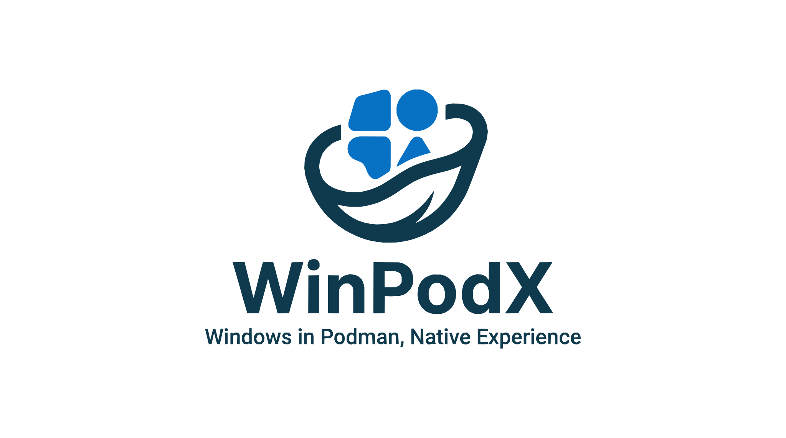

<div align="center">



### Click an app. Word opens. That's it.

<p>Native Linux windows for every Windows app — real icons, real <code>WM_CLASS</code>,<br>
pin-to-taskbar. FreeRDP RemoteApp + dockur/windows. Zero config.</p>

<pre><code>curl -fsSL https://raw.githubusercontent.com/kernalix7/winpodx/main/install.sh | bash</code></pre>

[](#status-beta)
[](https://github.com/kernalix7/winpodx/releases)

[](LICENSE)
[](https://www.python.org/)
[](#testing)
[](https://github.com/kernalix7/winpodx/actions/workflows/ci.yml)
[](https://github.com/kernalix7/winpodx/stargazers)
[](https://github.com/kernalix7/winpodx/releases)

###### Works on

[](https://www.opensuse.org/)
[](https://fedoraproject.org/)
[](https://www.debian.org/)
[](https://ubuntu.com/)
[](https://www.redhat.com/)
[-pending-lightgrey?style=flat-square&logo=archlinux&logoColor=white)](packaging/aur/README.md)

<sub>**English** &nbsp;·&nbsp; [한국어](docs/README.ko.md) &nbsp;·&nbsp; [Quick start](#quick-start) &nbsp;·&nbsp; [Features](#key-features) &nbsp;·&nbsp; [CLI](#cli-reference) &nbsp;·&nbsp; [Multi-session](#multi-session-rdp)</sub>

</div>

---

> ### Status: Beta
> winpodx is in active development (v0.2.0.x). The install path, FreeRDP RemoteApp integration, Windows-side runtime applies, and discovery flow have all been hardened across the v0.1.9 → v0.2.0.x line, but you should still expect rough edges — especially on first install (Windows VM first-boot can take 5–10 minutes; see `winpodx pod wait-ready --logs` for live progress). Please file issues at <https://github.com/kernalix7/winpodx/issues> if something breaks.

**No full-screen RDP.** Each Windows app becomes its own Linux window with its real icon — pinnable, alt-tabbable, file-associated. Drop into a full Windows desktop only when you actually want one (`winpodx app run desktop`).

winpodx runs a Windows container (via [dockur/windows](https://github.com/dockur/windows)) in the background and presents Windows apps as native Linux applications through FreeRDP RemoteApp. No manual VM setup, no ISO downloads, no registry editing. **Near-zero external Python dependencies** (stdlib only on Python 3.11+; one pure-Python `tomli` fallback on 3.9/3.10).

## Why winpodx?

Existing tools for running Windows apps on Linux all have trade-offs:

| | winapps | LinOffice | winboat | winpodx |
|---|---|---|---|---|
| Core tech | dockur + FreeRDP | dockur + FreeRDP | dockur + FreeRDP | dockur + FreeRDP |
| Setup | Manual (shell + config + RDP testing) | One-liner script | One-click GUI installer | **Zero-config** (auto on first launch) |
| Interface | CLI only | CLI only | Electron GUI | **Qt6 GUI + CLI + tray** |
| App scope | Any Windows app | Office only | Any Windows app | Any Windows app |
| Language | Shell (86%) | Shell + Python | TypeScript / Vue / Go | **Python (100%)** |
| Runtime deps | curl, dialog, git, netcat | Podman, FreeRDP | Electron, Docker/Podman, FreeRDP | **Python 3.9+, FreeRDP, Podman** |
| Auto suspend / resume | No | No | Not documented | **Yes (idle timeout)** |
| Password rotation | No | No | Not documented | **Yes (7-day, atomic)** |
| HiDPI auto-detect | No | No | Not documented | **GNOME, KDE, Sway, Hyprland, Cinnamon, xrdb** |
| Sound default | No | No | Yes (FreeRDP) | Yes (FreeRDP) |
| Printer redirection default | No | No | Not documented | Yes (FreeRDP) |
| USB drive auto-mapping | No | No | Smartcard passthrough | **Drive subfolders → drive letters via FileSystemWatcher** |
| Discovery (auto-scan installed apps) | No | No | Yes | **Yes (Registry + Start Menu + UWP + choco/scoop)** |
| Multi-session RDP | No | No | Not documented | **Yes (bundled rdprrap, up to 10)** |
| Offline / air-gapped install | No | No | No | **Yes (`--source` + `--image-tar`)** |
| License | MIT | AGPL-3.0 | MIT | MIT |

> winboat is the closest peer in scope and was an inspiration. We focus on a different mix — stdlib-leaning Python + Qt6 instead of Electron, deeper auto-config (auto suspend, 7-day password rotation, multi-DE HiDPI), and an explicit air-gapped install path. Both projects build on dockur/windows; that ecosystem is bigger than any one app.

## winpodx vs Wine

**winpodx is not a Wine replacement.** Wine translates Windows API calls; winpodx runs the actual Windows OS in a container. The two solve different problems and many users have both installed.

| When you need... | Use |
|---|---|
| Older Win32 apps, indie games, lightweight utilities | **Wine / Bottles / Lutris** |
| GPU-accelerated games / 3D apps (DirectX 9 – 12) | **Wine** — DXVK / VKD3D give near-native frame rates. winpodx has no GPU passthrough by default; QEMU CPU rendering is much slower. (GPU passthrough via VFIO is a manual bring-your-own setup — not yet packaged.) |
| Microsoft 365 with full Outlook + Teams + OneDrive integration | **winpodx** |
| Adobe Creative Suite (Photoshop, Illustrator, Premiere, Lightroom) | winpodx — but heavy GPU effects will be CPU-bound (see GPU row above) |
| Anti-cheat games (Valorant, EAC, BattlEye) | **TBD** — anti-cheats vary by VM-detection policy (Vanguard needs TPM 2.0 + no hypervisor, EAC mostly blocks VMs, VAC is lenient). Test before committing. |
| DRM-heavy software / hardware dongle apps | **winpodx** |
| Apps that ship kernel-mode drivers (some VPNs, security suites) | **winpodx** |
| Banking / tax / government tools with regional certificates | **winpodx** |
| Visual Studio, WinUI 3 / WinRT, .NET features Wine hasn't caught up to | **winpodx** |
| IE-only legacy enterprise web apps | **winpodx** |
| Anything where "mostly works" isn't acceptable | **winpodx** |

Wine wins on speed and on GPU when DXVK/VKD3D translate cleanly. winpodx wins on **100% Windows feature parity** for everything else — every app runs on a real Windows kernel, rendered into your Linux desktop as a native window via FreeRDP RemoteApp.

## Key Features

<table>
<tr><td width="50%">

**Seamless App Windows**
- RemoteApp (RAIL) renders each app as a native Linux window (no full desktop)
- Per-app taskbar icons via `WM_CLASS` matching (`/wm-class:<stem>` + `StartupWMClass`)
- File associations: double-click `.docx` in your file manager → Word opens
- Multi-session RDP: bundled rdprrap auto-enables up to 10 independent sessions
- RAIL prerequisites (`fDisabledAllowList=1` + `fInheritInitialProgram=1` + `MaxInstanceCount=10`) are set automatically during unattended install

</td><td width="50%">

**Zero-Config Launch**
- First app click auto-provisions everything: config, container, desktop entries
- **Auto-discovery on first boot** — winpodx scans the running Windows guest and registers every installed app (Registry App Paths, Start Menu, UWP/MSIX, Chocolatey, Scoop) with the real binary's icon
- Manual rescan any time via `winpodx app refresh` or the GUI Refresh button
- Interactive setup wizard for advanced configuration

</td></tr>
<tr><td width="50%">

**Peripherals & Sharing**
- **Clipboard**: Bidirectional copy-paste (text + images) enabled by default
- **Sound**: RDP audio streaming (`/sound:sys:alsa`) enabled by default
- **Printer**: Linux printers shared to Windows via RDP redirection (default)
- **USB drives**: Linux mount tree shared as `\\tsclient\media`; drives plugged after session start are still accessible as subfolders
- **USB drive auto-mapping**: Windows-side FileSystemWatcher script auto-maps `\\tsclient\media\<USB>` subfolders to drive letters (E:, F:, ...)
- **USB device passthrough**: `/usb:auto` is allowlisted but **not enabled by default** — opt in via `extra_flags` if your FreeRDP build ships the urbdrc plugin
- **Home directory**: Shared as `\\tsclient\home` (default)
- **Desktop shortcuts**: Windows desktop auto-populated with `\\tsclient\home` ("Home") and `\\tsclient\media` ("USB") shortcuts during first boot

**GPU acceleration:** not yet supported. dockur/windows runs under QEMU/KVM with software graphics — DirectX-heavy games and 3D apps will be CPU-bound. GPU passthrough via VFIO is feasible but not packaged. (See [winpodx vs Wine](#winpodx-vs-wine) — Wine + DXVK is the right tool when you need GPU.)

</td><td width="50%">

**Automation & Security**
- Auto suspend/resume: container pauses when idle, resumes on next launch
- Password auto-rotation: 20-char cryptographic password, 7-day cycle with rollback
- Smart DPI scaling: auto-detects from GNOME, KDE, Sway, Hyprland, Cinnamon, xrdb
- Qt6 system tray + full Qt6 main window (Apps / Settings / Tools / Terminal pages)
- Multi-backend: Podman (default), Docker, libvirt/KVM, manual RDP
- Windows build pinned to 11 25H2 (`TargetReleaseVersionInfo=25H2`, 365-day feature-update defer)
- Windows debloat: disable telemetry, ads, Cortana, search indexing, services (DiagTrack / dmwappushservice / WSearch / SysMain)
- High-performance power plan + hibernation off + tzutil UTC + Cloudflare DNS
- Time sync: force Windows clock resync after host sleep/wake
- FreeRDP `extra_flags` allowlist (regex-validated) as the user-input safety boundary

</td></tr>
</table>

## How It Works

```
                     ┌─────────────────────────────┐
  Click "Word"       │     Linux Desktop (KDE,      │
  in app menu  ───>  │     GNOME, Sway, ...)        │
                     └──────────────┬──────────────┘
                                    │
                     ┌──────────────▼──────────────┐
                     │         winpodx              │
                     │  ┌─────────────────────┐     │
                     │  │ auto-provision:      │     │
                     │  │  config → password   │     │
                     │  │  → container → RDP   │     │
                     │  │  → desktop entries   │     │
                     │  └─────────────────────┘     │
                     └──────────────┬──────────────┘
                                    │ FreeRDP RemoteApp
                     ┌──────────────▼──────────────┐
                     │   Windows Container (Podman) │
                     │   ┌──────────────────────┐   │
                     │   │  Word  Excel  PPT ... │   │
                     │   │ multi-session/rdprrap │   │
                     │   └──────────────────────┘   │
                     │   127.0.0.1:3390 (TLS)       │
                     └─────────────────────────────┘
```

## GUI

Launch with `winpodx gui`. The Qt6 main window has four pages:

| Page | What it does |
|------|--------------|
| **Apps** | Grid / list view of installed app profiles, search + category filter, per-app launch with 3s cooldown, Add / Edit / Delete app profile dialogs |
| **Settings** | RDP (user / IP / port / scale / DPI / password rotation) and Container (backend / CPU / RAM / idle timeout) in one screen |
| **Tools** | Suspend / Resume / Full Desktop buttons, Clean Locks / Sync Time / Debloat, and a one-click Windows Update **enable / disable** toggle |
| **Terminal** | Embedded shell limited to a command allowlist (`podman`, `docker`, `virsh`, `winpodx`, `xfreerdp`, `systemctl`, `journalctl`, `ss`, `ip`, `ping`, ...) with quick buttons (Status / Logs / Inspect / RDP Test / Clear) |

The system tray (`winpodx tray`) is a lighter-weight alternative — pod controls, app launcher submenu (top 20 + Full Desktop), maintenance submenu (Clean Locks / Sync Time / Suspend), and an optional idle-monitor thread.

## Tech Stack

| Layer | Technology |
|-------|------------|
| Language | Python 3.9+ (stdlib only on 3.11+; `tomli` fallback on 3.9/3.10) |
| CLI | argparse (stdlib) |
| GUI (optional) | PySide6 (Qt6) |
| Config | TOML (stdlib `tomllib` on 3.11+ / `tomli` on 3.9/3.10; built-in writer) |
| RDP | FreeRDP 3+ (xfreerdp, RemoteApp/RAIL) |
| Container | Podman / Docker ([dockur/windows](https://github.com/dockur/windows)) |
| VM | libvirt / KVM |
| CI | GitHub Actions (lint + test on 3.9-3.13 + pip-audit) |

## Quick Start

### Install

**One-line install** (any supported Linux distro):

```bash
curl -fsSL https://raw.githubusercontent.com/kernalix7/winpodx/main/install.sh | bash
```

Detects your distro, installs missing system dependencies (Podman, FreeRDP,
KVM, Python 3.9+) with your confirmation, drops winpodx into
`~/.local/bin/winpodx-app/`. The Windows-app menu populates automatically
the first time the pod boots — discovery scans your running Windows guest
and registers every installed app with its real icon. No root required
except for the dependency install step. Works on
openSUSE, Fedora, Debian/Ubuntu, RHEL-family, and Arch.

**Offline / air-gapped install** — the installer takes three optional flags
for machines with no registry / package-repo access:

```bash
# Copy winpodx from a local clone instead of git clone (also env: WINPODX_SOURCE)
./install.sh --source /media/usb/winpodx

# Preload the Windows image tar instead of fetching at first boot (env: WINPODX_IMAGE_TAR)
./install.sh --image-tar /media/usb/windows-image.tar

# Skip distro package install (env: WINPODX_SKIP_DEPS=1) — fails early if deps aren't present
./install.sh --skip-deps

# Everything at once:
./install.sh --source /media/usb/winpodx --image-tar /media/usb/windows-image.tar --skip-deps
```

Env vars are honored even under `curl | bash`, so
`WINPODX_SKIP_DEPS=1 curl ... | bash` works.

**One-line uninstall** — `--confirm` or `--purge` is required under pipe
(the interactive prompts can't read from a terminal while bash consumes
stdin from curl):

```bash
# Remove winpodx files, keep the Windows container + its data
curl -fsSL https://raw.githubusercontent.com/kernalix7/winpodx/main/uninstall.sh | bash -s -- --confirm

# Full wipe: container, volume, config, launcher, everything
curl -fsSL https://raw.githubusercontent.com/kernalix7/winpodx/main/uninstall.sh | bash -s -- --purge
```

Prefer a native package manager? Prebuilt RPM / `.deb` / AUR packages are
attached to every [GitHub Release](https://github.com/kernalix7/winpodx/releases/latest)
— openSUSE/Fedora RPMs from the
[openSUSE Build Service (`home:Kernalix7/winpodx`)](https://build.opensuse.org/package/show/home:Kernalix7/winpodx),
the rest from GitHub Actions:

**openSUSE Tumbleweed / Leap 15.6 / Leap 16.0 / Slowroll**

```bash
sudo zypper addrepo \
  https://download.opensuse.org/repositories/home:/Kernalix7/openSUSE_Tumbleweed/home:Kernalix7.repo
sudo zypper refresh
sudo zypper install winpodx
```

Replace `openSUSE_Tumbleweed` with `openSUSE_Leap_16.0`, `openSUSE_Leap_15.6`,
or `openSUSE_Slowroll` as needed.

**Fedora 42 / 43**

```bash
sudo dnf config-manager --add-repo \
  https://download.opensuse.org/repositories/home:/Kernalix7/Fedora_43/home:Kernalix7.repo
sudo dnf install winpodx
```

**Debian 12 / 13, Ubuntu 24.04 / 25.04 / 25.10**

Download the matching `.deb` from the
[latest release](https://github.com/Kernalix7/winpodx/releases/latest) and
install:

```bash
sudo apt install ./winpodx_<version>_all_debian13.deb   # pick your flavor
```

**AlmaLinux / Rocky / RHEL 9 & 10**

EPEL is required on el9 for `python3-tomli`. Download the matching `.rpm`
from the [latest release](https://github.com/Kernalix7/winpodx/releases/latest)
and install:

```bash
sudo dnf install epel-release                     # el9 only
sudo dnf install ./winpodx-<version>-1.noarch.el9.rpm   # or .el10.rpm
```

**Arch Linux (AUR)**

> Note: AUR publishing is wired up but pending a one-time maintainer setup
> (see [`packaging/aur/README.md`](packaging/aur/README.md)). Once activated,
> tag pushes publish automatically.

```bash
yay -S winpodx        # or:
paru -S winpodx
```

**From source (development)**

```bash
git clone https://github.com/kernalix7/winpodx.git
cd winpodx
./install.sh
```

The source installer automatically:
1. Detects your distro (openSUSE, Fedora, Ubuntu, Arch, ...)
2. Installs missing dependencies (Podman, FreeRDP, KVM), asks before installing
3. Copies winpodx to `~/.local/bin/winpodx-app/`
4. Creates config and compose.yaml
5. Auto-discovery (`winpodx app refresh`) fires on first pod boot to populate the menu

### Launch

```bash
winpodx app run word              # Launch Word
winpodx app run word ~/doc.docx   # Open a file
winpodx app run desktop           # Full Windows desktop
```

Or just click an app icon in your menu.

### Manual Run (no install)

```bash
git clone https://github.com/kernalix7/winpodx.git
cd winpodx
export PYTHONPATH="$PWD/src"
python3 -m winpodx app run word
```

---

## CLI Reference

<details>
<summary><b>Click to expand full CLI reference</b></summary>

```bash
# Apps
winpodx app list                  # List available apps
winpodx app run word              # Launch Word (auto-provisions on first run)
winpodx app run word ~/doc.docx   # Open a file in Word
winpodx app run desktop           # Full Windows desktop session
winpodx app install-all           # Register all apps in desktop menu
winpodx app sessions              # Show active sessions
winpodx app kill word             # Kill an active session

# Pod management
winpodx pod start --wait          # Start and wait for RDP readiness
winpodx pod stop                  # Stop (warns about active sessions)
winpodx pod status                # Status with session count
winpodx pod restart
winpodx pod apply-fixes           # Re-apply Windows-side runtime fixes (idempotent)
winpodx pod sync-password         # Recover from password drift (cfg ↔ Windows)
winpodx pod multi-session on      # Toggle bundled rdprrap multi-session RDP
winpodx pod multi-session status
winpodx pod wait-ready --logs     # Wait for Windows first-boot with progress + container logs

# Power management
winpodx power --suspend           # Pause container (free CPU, keep memory)
winpodx power --resume            # Resume paused container

# Security
winpodx rotate-password           # Rotate Windows RDP password

# Maintenance
winpodx cleanup                   # Remove Office lock files (~$*.*)
winpodx timesync                  # Force Windows time synchronization
winpodx debloat                   # Disable telemetry, ads, bloat
winpodx uninstall                 # Remove winpodx files (keeps container)
winpodx uninstall --purge         # Remove everything including config

# System
winpodx setup                     # Interactive setup wizard
winpodx info                      # Display, dependencies, config diagnostics
winpodx gui                       # Launch Qt6 main window (Apps / Settings / Tools / Terminal)
winpodx tray                      # Launch Qt system tray icon
winpodx config show               # Show current config
winpodx config set rdp.scale 140  # Change a config value
winpodx config import             # Import existing winapps.conf
```

</details>

## Peripherals & Sharing

| Feature | How it works | Default |
|---------|-------------|---------|
| **Clipboard** | Bidirectional copy-paste via RDP (`+clipboard`) | Enabled |
| **Sound** | Audio streaming via ALSA (`/sound:sys:alsa`) | Enabled |
| **Printer** | Linux printers shared to Windows (`/printer`) | Enabled |
| **Home directory** | Shared as `\\tsclient\home` (`+home-drive`) | Enabled |
| **USB drives** | Media folder shared as `\\tsclient\media` (`/drive:media`); USB drives plugged in after session start are accessible as subfolders | Enabled |
| **USB device passthrough** | Native USB redirection (`/usb:auto`) — requires FreeRDP urbdrc plugin | **Opt-in** (add to `extra_flags`) |
| **USB drive mapping** | Windows-side script auto-maps USB subfolders to drive letters (E:, F:, ...) via FileSystemWatcher | Enabled |

### USB Drive Flow

```
Plug in USB on Linux
    │
    ▼
Linux mounts to /run/media/$USER/USBNAME
    │
    ▼
FreeRDP shares as \\tsclient\media\USBNAME
    │
    ▼
media_monitor.ps1 detects → net use E: \\tsclient\media\USBNAME
    │
    ▼
Windows Explorer shows E: drive
```

## Configuration

Config file: `~/.config/winpodx/winpodx.toml` (auto-created, 0600 permissions)

```toml
[rdp]
user = "User"
password = ""                # Auto-generated random password
password_updated = ""        # ISO 8601 timestamp
password_max_age = 7         # Days before auto-rotation (0 = disable)
ip = "127.0.0.1"
port = 3390
scale = 100                  # Auto-detected from your DE
dpi = 0                      # Windows DPI % (0 = auto)
extra_flags = ""             # Additional FreeRDP flags (allowlisted)

[pod]
backend = "podman"
win_version = "11"                               # 11 | 10 | ltsc10 | tiny11 | tiny10
cpu_cores = 4
ram_gb = 4
vnc_port = 8007
auto_start = true                                # Start pod automatically when launching an app
idle_timeout = 0                                 # Seconds before auto-suspend (0 = disabled)
boot_timeout = 300                               # Seconds to wait for first-boot unattended install
image = "ghcr.io/dockur/windows:latest"          # Container image (override for air-gapped mirror)
disk_size = "64G"                                # Virtual disk size passed to dockur
```

## App Profiles

App profiles are **metadata only**: they describe where a Windows app lives so winpodx can launch it through FreeRDP RemoteApp. The actual Windows application must be installed inside the Windows container.

### Auto-discovery (default)

Starting from v0.1.9 winpodx ships **no curated profile list**. The first time the Windows pod boots, the provisioner runs `winpodx app refresh` and that scans the running guest:

- Registry `App Paths` (`HKLM` + `HKCU`)
- Start Menu `.lnk` recursion (depth-capped)
- UWP / MSIX packages via `Get-AppxPackage` + `AppxManifest.xml`
- Chocolatey + Scoop shims

For each result it extracts the icon directly from the binary (or the package's logo asset for UWP) and writes the entry to `~/.local/share/winpodx/discovered/<slug>/`. Re-run any time:

```bash
winpodx app refresh        # CLI
# or click "Refresh Apps" on the GUI Apps page
```

<details>
<summary><b>Adding a custom app profile manually</b></summary>

User-authored profiles live under `~/.local/share/winpodx/apps/` and override anything discovery finds with the same `name`:

```bash
mkdir -p ~/.local/share/winpodx/apps/myapp
cat > ~/.local/share/winpodx/apps/myapp/app.toml << 'EOF'
name = "myapp"
full_name = "My Application"
executable = "C:\\Program Files\\MyApp\\myapp.exe"
categories = ["Utility"]
mime_types = []
EOF

winpodx app install myapp   # Register in desktop menu
```

</details>

## Multi-Session RDP

Stock Windows Desktop editions limit RDP to one session per user; a second app
would otherwise reconnect and steal the first session. winpodx bundles
[rdprrap](https://github.com/kernalix7/rdprrap) — a Rust reimplementation of
RDPWrap — inside the package itself and installs it automatically during the
Windows unattended install, so each RemoteApp window gets its own independent
session.

**RAIL prerequisites.** RemoteApp itself requires three registry settings that
winpodx applies during unattended setup: `fDisabledAllowList=1` (enables
RemoteApp publishing), `fInheritInitialProgram=1` (required for
`/app:program:...` to launch the target executable instead of a shell), and
`MaxInstanceCount=10` paired with `fSingleSessionPerUser=0` (lifts the
single-session cap up to 10 concurrent RemoteApp windows). These are set
regardless of whether rdprrap installs successfully — rdprrap is what makes
the sessions *independent*, but the registry keys are what make RemoteApp
work at all. After rdprrap install `TermService` is cycled so the wrapper
DLL activates without a reboot.

**Authentication channel.** NLA is disabled (`UserAuthentication=0`) so the
FreeRDP command line can authenticate unattended from under
`podman unshare --rootless-netns`, but `SecurityLayer=2` keeps the RDP
channel itself encrypted with TLS (so `/sec:tls /cert:ignore` against
`127.0.0.1` is the full authenticated + encrypted path — no cleartext on the
wire even though NLA is off).

**Works fully offline.** The rdprrap zip ships inside winpodx's data directory
(`config/oem/`) and is staged into `C:\OEM\` during the guest's first boot.
sha256 is verified against a pin file before extraction. No network access is
required at install time.

Install is one-shot: the patch is applied during dockur's unattended setup
phase. If anything in that step fails (hash mismatch, extraction, installer
error), winpodx logs a warning and the guest stays in single-session mode —
app launch never blocks on this step. A guest-side management channel
(enable/disable/status after install) is planned for a later release.

## Install / Uninstall

```bash
# From a cloned repo:
./install.sh                # Install (detects distro, installs deps, registers apps)
./uninstall.sh              # Uninstall (interactive, asks before each step)
./uninstall.sh --confirm    # Uninstall (auto, keeps config)
./uninstall.sh --purge      # Uninstall (removes everything including config)

# Or one-liner (no clone needed):
curl -fsSL https://raw.githubusercontent.com/kernalix7/winpodx/main/install.sh   | bash
curl -fsSL https://raw.githubusercontent.com/kernalix7/winpodx/main/uninstall.sh | bash -s -- --confirm
curl -fsSL https://raw.githubusercontent.com/kernalix7/winpodx/main/uninstall.sh | bash -s -- --purge
```

**Uninstall only removes winpodx files.** It never touches:
- Your Podman containers/volumes (Windows VM data)
- System packages (podman, freerdp, python3)
- Your home directory files

## Project Structure

```
winpodx/
├── install.sh             # One-line installer (no pip)
├── uninstall.sh           # Clean uninstaller
├── src/winpodx/
│   ├── cli/               # argparse commands (app, pod, config, setup, ...)
│   ├── core/              # Config, RDP, pod lifecycle, provisioner, daemon
│   ├── backend/           # Podman, Docker, libvirt, manual
│   ├── desktop/           # .desktop entries, icons, MIME, tray, notifications
│   ├── display/           # X11/Wayland detection, DPI scaling
│   ├── gui/               # Qt6 main window, app dialog, theme
│   └── utils/             # XDG paths, deps, TOML writer, winapps compat
├── data/                  # winpodx GUI desktop entry + icon + config example
├── config/oem/            # Windows OEM scripts (post-install)
├── scripts/windows/       # PowerShell scripts (debloat, time sync, USB mapping, app discovery)
├── .github/workflows/     # CI: lint + test + upstream update checker
└── tests/                 # pytest test suite (411 tests)
```

## Supported Distros

| Distro | Package Manager | Status |
|--------|----------------|--------|
| openSUSE Tumbleweed/Leap | zypper | Tested |
| Fedora / RHEL / CentOS | dnf | Supported |
| Ubuntu / Debian / Mint | apt | Supported |
| Arch / Manjaro | pacman | Supported |

## Testing

```bash
# From repo root (no install needed)
export PYTHONPATH="$PWD/src"
python3 -m pytest tests/ -v    # 411 tests
ruff check src/ tests/         # Lint
```

## Contributing

See [CONTRIBUTING.md](CONTRIBUTING.md) for development setup and workflow.

## Releasing & Packaging

Each tag push (`v*.*.*`) publishes to all supported channels automatically:

| Channel | Distros |
|---------|---------|
| RPM (openSUSE / Fedora / Slowroll) | Tumbleweed, Leap 15.6, Leap 16.0, Slowroll, Fedora 42/43 |
| RPM (RHEL-family) | AlmaLinux 9 / 10 (also covers RHEL, Rocky, Oracle Linux 9/10) |
| `.deb` | Debian 12 / 13, Ubuntu 24.04 / 25.04 / 25.10 |
| AUR | Arch Linux (once activated — see [`packaging/aur/README.md`](packaging/aur/README.md)) |
| `sdist` + `wheel` | PyPI-compatible source/binary distributions |

Maintainer setup for each channel lives under [`packaging/`](packaging/):

- [`packaging/obs/README.md`](packaging/obs/README.md) — openSUSE Build Service (RPM family).
- [`packaging/aur/README.md`](packaging/aur/README.md) — Arch User Repository.
- Debian/Ubuntu and AlmaLinux builds are self-contained in their respective GitHub Actions workflows and need no external setup.

## Security

For security issues, follow the process in [SECURITY.md](SECURITY.md).

## License

[MIT](LICENSE) - Kim DaeHyun (kernalix7@kodenet.io)
