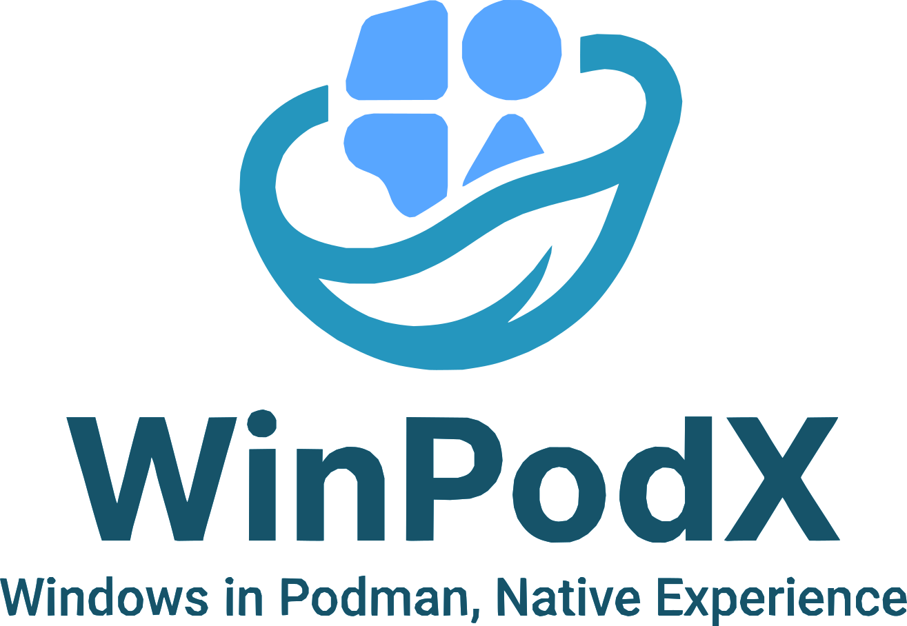
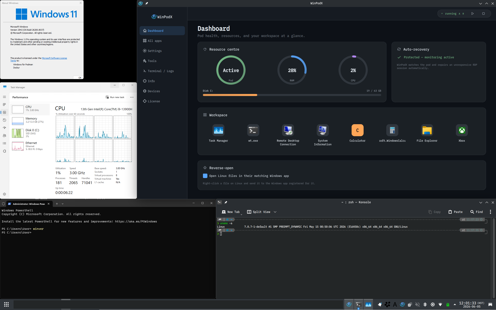

<div align="center">



### Click an app. Word opens. That's it.

<p>Native Linux windows for every Windows app — real icons, real <code>WM_CLASS</code>,<br>
pin-to-taskbar. FreeRDP RemoteApp + dockur/windows. Zero config.</p>

<pre><code># Latest stable release (default)
curl -fsSL https://raw.githubusercontent.com/kernalix7/winpodx/main/install.sh | bash

# Latest main HEAD (development; may be unstable)
curl -fsSL https://raw.githubusercontent.com/kernalix7/winpodx/main/install.sh | bash -s -- --main

# Uninstall (keeps Windows VM data; pass --purge to wipe everything)
curl -fsSL https://raw.githubusercontent.com/kernalix7/winpodx/main/uninstall.sh | bash -s -- --confirm</code></pre>

<a href="docs/images/demo.png">
  
</a>

<sub>Windows About / Task Manager / PowerShell each in their own Linux window, alongside the WinPodX Dashboard (live Pod / RAM / CPU gauges, workspace tiles).</sub>

[](#status-beta)
[](https://github.com/kernalix7/winpodx/releases)

[](LICENSE)
[](https://www.python.org/)
[](#testing)
[](https://github.com/kernalix7/winpodx/actions/workflows/ci.yml)
[](https://github.com/kernalix7/winpodx/stargazers)
[](https://github.com/kernalix7/winpodx/releases)

###### Works on

[](https://www.opensuse.org/)
[](https://fedoraproject.org/)
[](https://fedoraproject.org/atomic-desktops/)
[](https://www.debian.org/)
[](https://ubuntu.com/)
[](https://www.redhat.com/)
[](https://archlinux.org/)
[](docs/INSTALL.md#nix)
[](docs/INSTALL.md)

<sub>**English** &nbsp;·&nbsp; [한국어](docs/README.ko.md) &nbsp;·&nbsp; [Install](docs/INSTALL.md) &nbsp;·&nbsp; [Usage](docs/USAGE.md) &nbsp;·&nbsp; [Features](docs/FEATURES.md) &nbsp;·&nbsp; [Architecture](docs/ARCHITECTURE.md) &nbsp;·&nbsp; [Comparison](docs/COMPARISON.md)</sub>

</div>

---

> ### Status: Beta
> WinPodX is in active development (**v0.7.3**). **v0.7.0** introduced the **bare-metal disguise** (#246, opt-in / off by default): with `pod.disguise_level balanced | max` the Windows guest reads like a physical machine to VM-detection software (Nvidia GPU-passthrough "code 43", launch-gate VM checks, VM-hostile installers) — verified against al-khaser 0.82 — and the default guest username became `WPX-User`. **v0.7.1** is a UX + integration release: discovered Windows apps now register **automatic file associations** so they appear in your file manager's "Open with" menu (#545, on by default, only *added* — never set as the default handler); the GUI gains **app management** — reset-to-detected, a custom-icon picker, multi-select bulk hide/remove, and a restore list for deleted apps (#530); a **quick app launcher** (`winpodx launch`, #561) gives a Start-menu-style picker bindable to a DE hotkey; **`winpodx gui` no longer blocks the terminal** (#549); `winpodx doctor` **warns on an old FreeRDP** with broken RemoteApp windows (#546); and `install.sh --main` is now honoured on **Atomic Fedora** (#548). **v0.7.2** is a bug-fix release: it fixes a GUI crash on *Refresh Apps* (#567) and the tray *Terminate Session* / *USB Devices* submenus (#573) on KDE/Plasma, discovers apps with Chinese/Japanese/Korean names (#553), keeps the container across `pod stop` (no more recreate-on-update), and gives a clear error when Windows credentials are missing (#569). **v0.7.3** adds **reverse-open of files on the Windows VM itself** — not just your shared Home, the guest `C:` is shared over SMB and mounted with kio-fuse so a host app opens the real guest file and edits save back (#616, KDE) — an opt-in **idle auto-stop** that frees the VM's RAM (#622), and a **`+multitouch`** flag for touchscreen / stylus / pen passthrough (#623); it also fixes `winpodx app refresh` timing out on a slow guest (#619), the Dashboard RAM / Disk gauges sticking on "n/a" (#634), and removes the USB drive-letter auto-mapper that was destabilizing installs (#613, #638). The AppImage is **Thin** (~110 MB) — only FreeRDP + Python + Qt + winpodx — and uses the host's `podman` / `docker`. The CLI surface settled in 0.6.0 stands: **`winpodx guest`** (guest-side ops), **`winpodx install`** (install / disk ops), and **`winpodx doctor`** (diagnostics with `--json` / `--quick` / `--fix`); the post-create chain is the single **`winpodx provision`**. First install still takes ~5–10 minutes (Windows VM ISO download + Sysprep + OEM apply); `winpodx pod wait-ready --logs` shows live progress. Please file issues at <https://github.com/kernalix7/winpodx/issues> if something breaks.

**No full-screen RDP.** Each Windows app becomes its own Linux window with its real icon — pinnable, alt-tabbable, file-associated, both directions. Drop into a full Windows desktop only when you actually want one (`winpodx app run desktop`).

WinPodX runs a Windows container (via [dockur/windows](https://github.com/dockur/windows)) in the background and presents Windows apps as native Linux applications through FreeRDP RemoteApp, while a bearer-authed HTTP agent inside the guest handles the host→guest command channel without flashing a PowerShell window. The reverse direction — Linux apps surfaced in the Windows "Open with…" menu — is handled by a host-side listener that consumes JSON requests written by per-slug Rust shims inside the guest. **Near-zero external Python dependencies** (stdlib only on Python 3.11+; one pure-Python `tomli` fallback on 3.9/3.10).

## Minimum requirements

**Before installing**, make sure your machine actually supports virtualisation. WinPodX runs Windows in a KVM-backed container; without these three, the install will run to completion but Windows will never boot.

| Requirement | How to check | Fix |
|---|---|---|
| **Intel VT-x or AMD-V enabled in BIOS / UEFI** | `lscpu \| grep -i virtualization` shows `VT-x` or `AMD-V` | Reboot → firmware setup → enable "Intel Virtualization Technology" / "SVM Mode" / "VT-x". OFF by default on many laptops. |
| **kvm kernel module loaded** | `lsmod \| grep kvm` lists `kvm_intel` or `kvm_amd` | `sudo modprobe kvm_intel` (Intel) or `sudo modprobe kvm_amd` (AMD). Auto-loads on next boot once BIOS allows it. |
| **Your user is in the `kvm` group** | `id -nG \| tr ' ' '\n' \| grep kvm` returns `kvm` | `sudo usermod -aG kvm $USER`, then log out + back in. |

Hardware: x86_64 or aarch64 CPU with virtualisation extensions, 8 GB+ RAM (12 GB+ recommended), ~30 GB free disk for the Windows image. `install.sh` aborts with the same diagnostic if `/dev/kvm` is missing after the package install step — most "install ran fine but Windows never boots" bug reports trace back to one of the rows above.

## Quick install

One-liner (any supported Linux distro):

```bash
curl -fsSL https://raw.githubusercontent.com/kernalix7/winpodx/main/install.sh | bash
```

Or via a native package manager:

```bash
# openSUSE Tumbleweed / Leap / Slowroll
sudo zypper addrepo https://download.opensuse.org/repositories/home:/Kernalix7/openSUSE_Tumbleweed/home:Kernalix7.repo
sudo zypper install winpodx

# Fedora 42 / 43 / 44 (dnf5 — Fedora 41+)
sudo dnf config-manager addrepo --from-repofile=https://download.opensuse.org/repositories/home:/Kernalix7/Fedora_43/home:Kernalix7.repo
sudo dnf install winpodx

# Debian / Ubuntu — grab the matching .deb from the latest release
sudo apt install ./winpodx_<version>_all_debian13.deb

# AlmaLinux / Rocky / RHEL 9 / 10 — grab the matching .rpm
sudo dnf install ./winpodx-<version>-0.noarch.el10.rpm

# Arch
yay -S winpodx

# Nix
nix run github:kernalix7/winpodx

# AppImage (distro-agnostic, single file)
# Download winpodx-<version>-x86_64.AppImage from the latest GitHub release
chmod +x winpodx-*-x86_64.AppImage
./winpodx-*-x86_64.AppImage setup
```

> **After a package-manager / AppImage install:** run `winpodx setup` once to generate `~/.config/winpodx/winpodx.toml` + compose.yaml. The curl one-liner does this for you (and waits ~5–10 min for the Windows first boot); package installs ship the binary only so `apt install` / `dnf install` / `yay -S` / first AppImage launch don't trigger a 10-minute Windows ISO download out of the blue. After setup, just launching an app (`winpodx app run desktop`) auto-provisions the pod the first time.
>
> The Thin AppImage (0.6.0) bundles Python + Qt + winpodx + FreeRDP only — the container runtime lives on the host (`podman` ≥ 4 recommended, `docker` also supported) so the AppImage no longer fights a host stack you already have (#357, #363). Pre-0.6.0 fat AppImages bundled the whole podman stack and shadowed the host's. Host-side requirements left: a container runtime via your package manager, `/dev/kvm`, `kvm` group membership, and `/etc/subuid` / `/etc/subgid` for rootless Podman. `winpodx setup-host` fixes the kvm / subuid bits via a single `pkexec` prompt; `winpodx doctor` surfaces anything still missing.

See [docs/INSTALL.md](docs/INSTALL.md) for offline / air-gapped builds, source installs, version pinning, and uninstall.

## First-time setup

If you used the `curl install.sh` one-liner, setup already ran and the Windows VM is booting -- skip to [Launch](#launch). For every other install path (package managers, AppImage, source, pip) run setup once before the first app launch:

```bash
# Auto setup -- host-detected defaults, no prompts
winpodx setup

# Interactive wizard -- pick backend, cores, RAM, edition, language, timezone, debloat preset
winpodx setup --customize
```

Setup writes `~/.config/winpodx/winpodx.toml` + `compose.yaml`, registers the GUI launcher, and confirms the host has FreeRDP + Podman / Docker + KVM. If any of those are missing, the output ends with a per-distro install command (e.g. `sudo apt install xfreerdp3 podman podman-compose` on Debian / Ubuntu, `sudo dnf install ...` on Fedora) -- run it and re-run `winpodx setup`.

The first app launch then provisions the pod, pulls the dockur image, runs the Windows ISO download + Sysprep + OEM apply, and reaches a usable RDP session in ~5-10 min. `winpodx pod wait-ready --logs` tails container progress live so you can watch each phase:

```bash
winpodx app run desktop          # First launch -- ~5-10 min, subsequent launches near-instant
winpodx pod wait-ready --logs    # Optional: watch first-boot progress live
```

Run `winpodx doctor` any time afterwards to re-check host state and surface the next fix command if something drifts:

```bash
winpodx doctor                   # Read-only -- prints what would need fixing
winpodx guest apply-fixes        # Re-applies guest-side runtime fixes (RDP timeouts, NIC power-save, etc.)
```

## Launch

```bash
winpodx app run word              # Launch Word
winpodx app run word ~/doc.docx   # Open a file
winpodx app run desktop           # Full Windows desktop
winpodx launch                    # Quick app launcher (Start-menu style picker)
```

Or just click an app icon in your application menu. `winpodx launch` opens a searchable picker of your Windows apps — bind it to a desktop-environment custom shortcut (KDE: *System Settings → Shortcuts → Custom*; GNOME: *Settings → Keyboard → Custom Shortcuts*) for a system-wide hotkey. See [docs/USAGE.md](docs/USAGE.md) for the full CLI, the Qt6 GUI, health checks, and configuration.

## Key features

<table>
<tr><td colspan="2">

**Bare-metal disguise (VM-detection avoidance)** — new in 0.7.0 · opt-in, off by default
- Makes the Windows guest read as a **physical machine** to software that refuses to run under a detected hypervisor — Nvidia GPU-passthrough "code 43", launch-gate VM checks, VM-hostile installers
- `pod.disguise_level balanced | max`: **balanced** hides the CPUID hypervisor bit + KVM signature and mirrors the host's real SMBIOS/DMI; **max** ("Hardened") adds a locally-built patched-QEMU image (`winpodx disguise build-image`) that rewrites the ACPI / disk / sensor / USB fingerprints and drops the virtio + Red-Hat PCI tells (keeps USB3)
- Host-derived strings stay in the **local image only** (never committed to git); serial / UUID / asset-tag are never read
- **al-khaser 0.82-verified** — enable with `winpodx config set pod.disguise_level max` or the GUI Settings "Bare-metal" selector
- [Details →](docs/FEATURES.md#bare-metal-disguise-vm-detection-avoidance)

</td></tr>
<tr><td width="50%">

**Reverse-open**
- Linux apps appear in the Windows guest's right-click "Open with…" menu by default
- Correct per-app icons in both the short menu and the long "Choose another app" dialog
- Selecting one round-trips the file open to host `xdg-open`
- Auto-discovers host-side Linux apps + their MIME associations from freedesktop standards
- Manage via `winpodx host-open` CLI or the GUI Settings panel
- [Details →](docs/FEATURES.md#reverse-open-linux-apps-in-windows-open-with)

</td><td width="50%">

**Seamless app windows**
- RemoteApp (RAIL) renders each Windows app as a native Linux window — no full desktop
- Per-app taskbar icons via `WM_CLASS` matching (`/wm-class:<stem>` + `StartupWMClass`)
- Bidirectional file associations: double-click `.docx` in your file manager → Word opens
- Multi-session RDP: bundled [rdprrap](https://github.com/kernalix7/rdprrap) auto-enables up to 10 independent sessions
- Multi-monitor RAIL (0.6.0): a remote-app window keeps working input when dragged onto a second monitor — on by default (`cfg.rdp.multimon`, default `span`)
- RAIL prerequisites set automatically during unattended install

</td></tr>
<tr><td width="50%">

**Zero-config launch**
- First app click auto-provisions everything: config, container, desktop entries
- Auto-discovery on first boot scans the running Windows guest and registers every installed app with its real icon (Registry App Paths, Start Menu, UWP/MSIX, Chocolatey, Scoop)
- Manual rescan any time via `winpodx app refresh` or the GUI Refresh button
- Multi-backend: Podman (default), Docker, manual RDP (the libvirt backend was dropped in 0.6.0 — stay on ≤0.5.x or use the manual backend for your own libvirt domain)

</td><td width="50%">

**Peripherals & sharing**
- **Clipboard**: bidirectional copy-paste (text + images) — on by default
- **Sound**: RDP audio streaming (`/sound:sys:alsa`) — on by default
- **Printer**: Linux printers shared to Windows — on by default
- **Home directory**: shared as `\\tsclient\home`
- **USB drives**: auto-mapped to drive letters (E:, F:, …) via FileSystemWatcher; subfolders work for drives plugged in after session start; the USB desktop shortcut (`\\tsclient\media`) always resolves, opening an empty folder when nothing is mounted instead of erroring
- **Host USB / PCI device passthrough** (0.6.0): pass real host devices into the Windows guest — `winpodx device list / attach <id> / detach <id>`, a GUI "Devices" tab (two-column host↔guest mover), and a system-tray USB switcher. USB hot-plugs live (`cfg.pod.usb_live`, default on); PCI is boot-added and needs a guest restart plus a `--force` / dialog confirmation

</td></tr>
<tr><td width="50%">

**Automation & security**
- Auto suspend / resume: container pauses when idle, resumes on next launch
- Pod auto-start on login (v0.5.9, opt-in): `winpodx autostart on` installs a tray autostart entry so the pod starts/resumes at login — off by default (`autostart off|status`, or a GUI Settings checkbox)
- UNRESPONSIVE → recover (v0.5.5): stalled RDP guest is detected on `RUNNING → UNRESPONSIVE` and self-healed via in-guest TermService cycle, no `pod restart` needed
- Host-adaptive Windows-on-KVM tuning profile (v0.5.5): `+invtsc`, `platform_tick` and more, gated by host capability — `tuning_profile = auto|safe|off`
- Password auto-rotation: 20-char cryptographic password, 7-day cycle with atomic rollback
- Smart DPI scaling: auto-detects from GNOME, KDE, Sway, Hyprland, Cinnamon, xrdb
- Windows debloat: telemetry, ads, Cortana, search indexing disabled by default
- FreeRDP `extra_flags` allowlist (regex-validated) as the user-input safety boundary
- Time sync: force Windows clock resync after host sleep/wake

</td><td width="50%">

**Operations & resilience**
- Multilingual UI (v0.5.9): tray / GUI / CLI fully translated to 7 languages (en / ko / zh / ja / de / fr / it), auto-detected from `$LANG` — override with `winpodx language <code>` or GUI Settings → "WinPodX UI language"
- Windows disk auto-grow (v0.5.9): C: grows itself when it fills past a threshold while idle, bounded by host free space — or grow on demand (`winpodx install grow-disk [SIZE]`, `winpodx install disk-usage`, GUI Tools → Grow Disk)
- Guest sync (v0.5.9): push updated agent / urlacl / rdprrap / fixes into a running guest after a host upgrade — automatic once per pod start, or `winpodx guest sync [--force]`
- Offline / air-gapped install (`--source` + `--image-tar`)
- One-line uninstall (keeps Windows VM data unless `--purge`)
- Health checks via `winpodx doctor` (deps / pod / RDP / agent / disk / round-trip / password age; `--json` for machine-readable, `--quick` for cheap subset, `--fix` for idempotent auto-remediation of common findings)
- Redesigned Qt6 GUI (0.6.0): a left Start-menu-style navigation sidebar + a new **Dashboard** home with live Pod / RAM / CPU ring gauges, disk usage, an auto-recovery status card, pinned/recent workspace tiles, and a reverse-open toggle; the app launcher is now the "All apps" page, alongside Devices / Settings / Tools / Terminal / Info — plus a lighter system tray. In-house SVG icon set, responsive reflow, and a hero search that doubles as a command bar
- Stdlib-leaning Python (no pip-deps on 3.11+; one `tomli` fallback on 3.9 / 3.10)

</td></tr>
</table>

See [docs/FEATURES.md](docs/FEATURES.md) for deep dives, including multi-session RDP internals, app profile schema, and the reverse-open architecture.

## Documentation

| Document | What's inside |
|----------|---------------|
| [INSTALL.md](docs/INSTALL.md) | Every install path — one-liner, package managers, AppImage, offline, Nix, source |
| [USAGE.md](docs/USAGE.md) | CLI reference, Qt6 GUI tour, health checks, configuration file |
| [FEATURES.md](docs/FEATURES.md) | Reverse-open, multi-session RDP, peripherals, app profiles, auto-discovery |
| [ARCHITECTURE.md](docs/ARCHITECTURE.md) | How it works (diagram), tech stack, source tree, data flows |
| [COMPARISON.md](docs/COMPARISON.md) | WinPodX vs winapps / LinOffice / winboat, and WinPodX vs Wine |
| [CHANGELOG.md](CHANGELOG.md) | Full version history |
| [CONTRIBUTING.md](CONTRIBUTING.md) | Development setup and workflow |
| [SECURITY.md](SECURITY.md) | Security disclosure process |

## Supported distros

| Distro | Package manager | Status |
|--------|-----------------|--------|
| openSUSE Tumbleweed / Leap 15.6 / Leap 16.0 / Slowroll | zypper | Tested |
| Fedora 42 / 43 / 44 / Rawhide | dnf | Supported |
| Fedora Silverblue / Kinoite / Sericea / Bluefin / Bazzite (42 / 43 / 44) | rpm-ostree (OBS, `--apply-live`) | Supported |
| Debian 12 / 13, Ubuntu 24.04 / 25.04 / 25.10 / 26.04 | apt | Supported |
| AlmaLinux / Rocky / RHEL 9 / 10 | dnf | Supported |
| Arch / Manjaro | pacman + `yay -S winpodx` | Supported |
| NixOS (and Nix on any distro) | nix flake | Supported |

Each tag push (`v*.*.*`) publishes to all channels automatically — see [packaging/](packaging/) for maintainer details.

## Testing

```bash
# From repo root (no install needed)
export PYTHONPATH="$PWD/src"
python3 -m pytest tests/    # 1800+ tests
ruff check src/ tests/      # Lint
ruff format --check src/ tests/
```

## Contributing

See [CONTRIBUTING.md](CONTRIBUTING.md) for development setup, branch naming, commit conventions, and CI expectations.

## Security

For security issues, follow the process in [SECURITY.md](SECURITY.md).

## Star History

<a href="https://star-history.com/#kernalix7/winpodx&Date">
  <picture>
    <source media="(prefers-color-scheme: dark)" srcset="https://api.star-history.com/svg?repos=kernalix7/winpodx&type=Date&theme=dark" />
    <source media="(prefers-color-scheme: light)" srcset="https://api.star-history.com/svg?repos=kernalix7/winpodx&type=Date" />
    
  </picture>
</a>

## Support

If WinPodX makes your Linux desktop a little nicer:

[](https://github.com/sponsors/kernalix7)
[](https://ko-fi.com/kernalix7)
[](https://fairy.hada.io/@kernalix7)

GitHub Sponsors supports recurring or one-time sponsorship; Ko-fi handles international cards and PayPal; fairy.hada.io is a Korean tipping platform. Bug reports, PRs, and stars on the repo are equally appreciated and free.

## License

[MIT](LICENSE) — Kim DaeHyun (kernalix7@kodenet.io)
