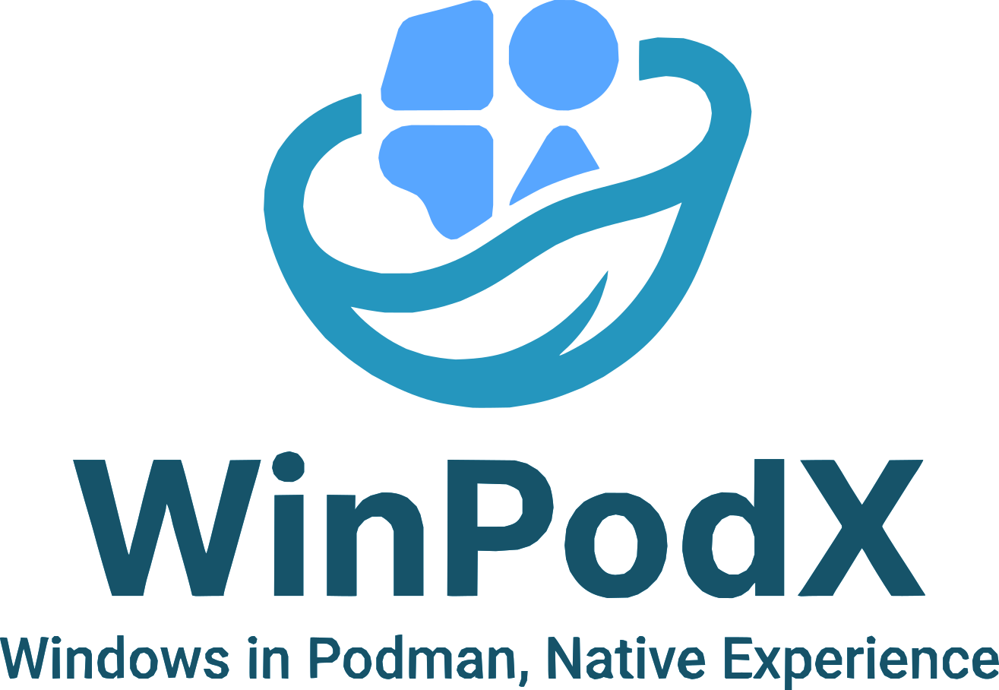
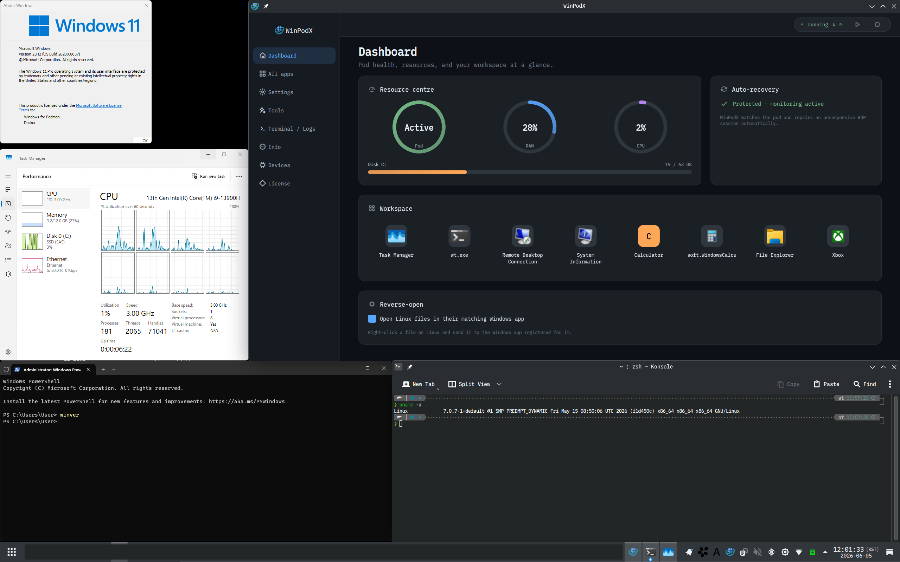

<div align="center">



### Click an app. Word opens. That's it.

<p>Windows apps as native Linux windows, with real icons and taskbar integration.<br>
FreeRDP RemoteApp over dockur/windows, without a permanent full-screen desktop.</p>

[](#status-beta)
[](https://github.com/kernalix7/winpodx/releases)
[](https://github.com/kernalix7/winpodx/actions/workflows/ci.yml)
[](#testing)

[](LICENSE)
[](https://www.python.org/)
[](https://github.com/kernalix7/winpodx/stargazers)
[](https://github.com/kernalix7/winpodx/releases)

###### Works on

[](https://www.opensuse.org/)
[](https://fedoraproject.org/)
[](https://fedoraproject.org/atomic-desktops/)
[](https://www.debian.org/)
[](https://ubuntu.com/)
[](https://www.redhat.com/)
[](https://archlinux.org/)
[](docs/INSTALL.md#nix)
[](docs/INSTALL.md)

<sub>**English** · [한국어](docs/README.ko.md) · [Install](docs/INSTALL.md) · [Usage](docs/USAGE.md) · [Features](docs/FEATURES.md) · [Architecture](docs/ARCHITECTURE.md) · [Comparison](docs/COMPARISON.md)</sub>

</div>

---

> ### Status: Beta
>
> WinPodX is in active development, **v0.11.0**.
>
> - Windows 11 Settings-style desktop app with responsive navigation and custom window chrome
> - Dashboard for pod state, resource use, running apps, pinned apps, and reverse-open
> - Searchable Applications catalogue, grouped Settings, tools, terminal logs, diagnostics, and device management
> - dockur HTTP provisioning progress in the CLI and GUI, with log fallback
> - A compact `winpodx launch` Start-style flyout and a refreshed tray launcher
>
> Read the complete [CHANGELOG](CHANGELOG.md).

## Install in three commands

```bash
curl -fsSL https://raw.githubusercontent.com/kernalix7/winpodx/main/install.sh | bash
winpodx setup
winpodx gui
```

The installer handles the first two commands for a normal curl install. Run `winpodx setup` after a package, AppImage, source, or wheel install. It creates the configuration, checks the host, provisions Windows, discovers apps, and registers desktop entries.

For the current development branch, add `-s -- --main` to the install command. To remove WinPodX while keeping the Windows VM, run `curl -fsSL https://raw.githubusercontent.com/kernalix7/winpodx/main/uninstall.sh | bash -s -- --confirm`. Add `--purge` only when you also want to remove the VM and configuration.

## What you get

<a href="docs/images/demo.png">
  
</a>

Windows apps open as their own Linux windows, with their icons, taskbar entries, file associations, clipboard, audio, printers, and shared files. Use `winpodx app run desktop` only when you need the full Windows desktop.

### Desktop app

<a href="docs/images/gui-dashboard.png">
  
</a>

The desktop app uses a Windows 11 Settings-style NavigationView. Dashboard puts pod state, Start and Stop, resource rings, quick actions, running apps, pinned apps, and reverse-open in one view. Applications provides Start Menu tiles, category counts, search, grid or list display, and context actions. Settings keeps connection, hardware, Windows Update, integration, localization, and destructive controls grouped together, with a dirty marker until you save.

Tools runs pod and system operations, Terminal holds logs and commands, Info includes health and copyable diagnostics, Devices groups USB and PCI assignments, and License completes the shell. The pane is 320 px wide at normal sizes, becomes a 48 px icon rail below 1100 px, and can overlay the content from the hamburger button. See the [GUI tour](docs/USAGE.md#qt6-gui-tour) for details.

## Requirements

| Requirement | Check | What to do if it is missing |
|---|---|---|
| Intel VT-x or AMD-V enabled | `lscpu \| grep -i virtualization` | Enable Intel Virtualization Technology, SVM Mode, or VT-x in firmware. |
| KVM loaded | `lsmod \| grep kvm` | Load `kvm_intel` or `kvm_amd`. |
| Your user can access KVM | `id -nG \| tr ' ' '\n' \| grep kvm` | Run `sudo usermod -aG kvm $USER`, then log out and back in. |

You need an x86_64 or aarch64 CPU with virtualization, 8 GB RAM minimum, 12 GB recommended, and enough disk for the 64 GB default Windows disk plus an ISO. Install FreeRDP 3+ and Podman with a compose provider, or Docker. Rootless Podman also needs `/etc/subuid` and `/etc/subgid` entries. `winpodx setup-host` and `winpodx doctor` report and can repair the common host setup issues.

## Key features

| Area | What it does |
|---|---|
| Seamless apps | RemoteApp opens each Windows app as a native Linux window, with real icons, `WM_CLASS`, taskbar integration, file associations, multimonitor support, and up to 50 independent RDP sessions. |
| App discovery | Imports Start Menu-visible Win32 and UWP apps with their icons. Refresh at any time with `winpodx app refresh` or Applications. |
| Sharing | Bidirectional clipboard, audio, printers, `\\tsclient\home`, removable media, USB passthrough, and PCI passthrough. PCI assignment requires a restart and is flagged when risky. |
| Reverse-open | Linux applications appear in Windows' **Open with** menu and receive files on the host through a controlled listener. |
| Pod operation | Podman is the default backend, Docker and manual RDP are supported. The pod can auto-pause when idle, recover a stalled guest, rotate passwords, grow the Windows disk, and synchronize guest fixes. |
| Privacy and tuning | Optional Windows debloat, host-adaptive KVM tuning, DPI detection, validated FreeRDP extra flags, time synchronization, and optional bare-metal disguise. |
| Languages | The CLI, tray, and desktop app support English, Korean, Chinese, Japanese, German, French, and Italian. |

For the configuration schema and technical detail, see [FEATURES.md](docs/FEATURES.md).

## Installation choices

Use the curl installer above on any supported distribution, or a native package:

```bash
# openSUSE Tumbleweed / Leap / Slowroll
sudo zypper addrepo https://download.opensuse.org/repositories/home:/Kernalix7/openSUSE_Tumbleweed/home:Kernalix7.repo
sudo zypper install winpodx

# Fedora 42 / 43 / 44 (dnf5 — Fedora 41+)
sudo dnf config-manager addrepo --from-repofile=https://download.opensuse.org/repositories/home:/Kernalix7/Fedora_43/home:Kernalix7.repo
sudo dnf install winpodx

# Debian / Ubuntu — grab the matching .deb from the latest release
sudo apt install ./winpodx_<version>_all_debian13.deb

# AlmaLinux / Rocky / RHEL 9 / 10 — grab the matching .rpm
sudo dnf install ./winpodx-<version>-0.noarch.el10.rpm

# Arch
yay -S winpodx

# Nix
nix run github:kernalix7/winpodx

# AppImage (distro-agnostic x86_64, single file)
# Download winpodx-x86_64.AppImage from the latest GitHub release
chmod +x winpodx-x86_64.AppImage
./winpodx-x86_64.AppImage setup
```

AppImage, source, offline, Nix, update, and uninstall instructions are in [INSTALL.md](docs/INSTALL.md). Package installs ship the binary only, so run `winpodx setup` yourself. Re-run the installer to update a curl installation in place. Package and AppImage installs update through the method used to install them.

On RHEL 9, AlmaLinux 9, and Rocky Linux 9, the default `python3` is below the supported floor. The el9 package pulls in the Python 3.11 stack from AppStream.

## Documentation

| Document | Contents |
|---|---|
| [INSTALL.md](docs/INSTALL.md) | Install, update, offline, source, Nix, and uninstall paths |
| [USAGE.md](docs/USAGE.md) | CLI reference, GUI tour, health checks, and configuration |
| [FEATURES.md](docs/FEATURES.md) | RemoteApp, reverse-open, peripherals, discovery, and device passthrough |
| [ARCHITECTURE.md](docs/ARCHITECTURE.md) | System diagram, source tree, and data flows |
| [COMPARISON.md](docs/COMPARISON.md) | Comparison with winapps, LinOffice, winboat, and Wine |
| [CHANGELOG.md](CHANGELOG.md) | Version history |
| [CONTRIBUTING.md](CONTRIBUTING.md) | Development setup and contribution workflow |
| [SECURITY.md](SECURITY.md) | Security reporting process |

## Supported distros

openSUSE Tumbleweed, Leap, and Slowroll. Fedora and Fedora Atomic desktops. Debian and Ubuntu. AlmaLinux, Rocky Linux, and RHEL. Arch and Manjaro. NixOS and Nix on other distributions. See [INSTALL.md](docs/INSTALL.md) for packages and repository commands.

## Testing

```bash
export PYTHONPATH="$PWD/src"
python3 -m pytest tests/ -n auto
ruff check src/ tests/
ruff format --check src/ tests/
```

## Contributing and license

Read [CONTRIBUTING.md](CONTRIBUTING.md) before sending a change. Security reports follow [SECURITY.md](SECURITY.md). WinPodX is [MIT licensed](LICENSE), Kim DaeHyun.

## Star History

<a href="https://github.com/kernalix7/winpodx/tree/star-history">
  <picture>
    <source media="(prefers-color-scheme: dark)" srcset="https://raw.githubusercontent.com/kernalix7/winpodx/star-history/chart-dark.svg" />
    <source media="(prefers-color-scheme: light)" srcset="https://raw.githubusercontent.com/kernalix7/winpodx/star-history/chart.svg" />
    
  </picture>
</a>

## Support

If WinPodX makes your Linux desktop a little nicer:

[](https://github.com/sponsors/kernalix7)
[](https://ko-fi.com/kernalix7)
[](https://fairy.hada.io/@kernalix7)

GitHub Sponsors supports recurring or one-time sponsorship; Ko-fi handles international cards and PayPal; fairy.hada.io is a Korean tipping platform. Bug reports, PRs, and stars on the repo are equally appreciated and free.
